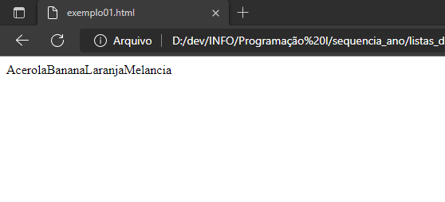
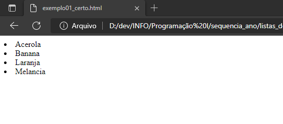

# Estrutura de Repetição - For Of

## Introdução

Ao utilizarmos as estruturas de repetição, torna-se possível fazer com que um ou mais comandos em um programa sejam executados várias vezes *(A quantidade de repetições, inclusive, pode ser determinada por você mesmo!)*.

Considere, por exemplo, o funcionamento de um caixa eletrônico, de uma bomba de combustível ou até mesmo um sistema de identificação de placas de veículo para liberação da entrada em um estacionamento. Estas soluções poderão repetir várias vezes o mesmo procedimento, sem qualquer intervenção humana. Obviamente que qualquer solução deste gênero deverá ter um ponto de interrupção, já definido previamente pelo desenvolvedor da solução. Um exemplo é o usuário informar a senha três vezes de forma incorreta, e assim não conseguirá autenticar-se para usar a solução.

Uma das utilizações mais comuns para as estruturas de repetição são as aplicações web que listam produtos que estão disponíveis para venda, por exemplo. Montam-se as descrições de todos os produtos, preços, marca, imagens... e a partir de uma estrutura de repetição percorrem-se todos os itens e então eles serão exibidos em um site.

Em cada repetição é possível desenvolver estruturas condicionais para mostrar os itens. Algumas condições que poderão ser aplicadas são limitar a exibição dos produtos dentro de um intervalo de preço, produtos apenas de uma marca, alunos apenas de uma turma, entre outros.

# for ... of

No contexto das estruturas de repetição, temos um recurso super valioso, que é o ***for Of***. Ele é util em uma situação onde você possui uma lista de itens, e precisa ler ou manipular esses itens.

O que vimos anteriormente, no assunto de [Vetores / Arrays](https://github.com/ldmfabio/1INFOs-vetores) é de grande relevância e ter aprendido o conceito de Arrays é requisito fundamental para começarmos os estudos sobre as estruturas de repetição.

Consideremos novamente o nosso exemplo abordado anteriormente, sobre a lista de compras:
```javascript
const listaCompras = ["Acerola", "Banana", "Laranja", "Melancia"];
```
Este código construirá a seguinte estrutura:
| Posição | Produto |
| :---: | :--- |
| 0 | Acerola |
| 1 | Banana |
| 2 | Laranja |
| 3 | Melancia |

Para visualizar o que ocorre, ao executar o código citado anteriormente, você pode usar o [Python Tutor - JavaScript](https://pythontutor.com/javascript.html#mode=edit).

No PythonTutor, ao executar a instrução para criar o array *listaCompras*, será mostrada a seguinte estrutura:


Ou seja, o conteúdo da posição **0 será "Acerola"**, o conteúdo da posição **1 será "Banana"**, o conteúdo da posição **2 será "Laranja"** e o conteúdo da posição **3 será "Melancia"**.

Para que possamos escrever o conteúdo de todas as posições do Array para que o usuário possa saber o que possui na sua lista de compras, por exemplo, devemos utilizar as estruturas de repetição. Nesse caso, ***for of***.

O código completo para exibir o conteúdo do array/lista para o usuário, será o seguinte:
```javascript
const listaCompras = ["Acerola", "Banana", "Laranja", "Melancia"];
for (let item of listaCompras) {
    document.write(item);
}
```
*Caso queira, é possível copiar o código acima e colar no site do PythonTutor para JavaScript, no link [https://pythontutor.com/javascript.html#mode=edit](https://pythontutor.com/javascript.html#mode=edit), substituindo o document.write por console.log. Após colar o código, clique em Visualize Execution e o site lhe mostrará todos os Steps - passos - que serão executados pelo programa. Clique em Next e acompanhe as instruções linha a linha.*

A estrutura de repetição ***(for of)*** começará a ler o conteúdo de cada posição do array *listaCompras*, e o que está na primeira posição **(posição 0)** será atribuído para a ***let item***.

Assim, considerando que o tamanho do nosso array é 4 (possui quatro elementos), o ***for of*** repetirá o comando *document.write* exatamente 4 vezes. Cada vez que repetir o comando, a ***let item*** terá um valor diferente, conforme a ordem dos itens que estão no array *listaCompras*. Ou seja, na primeira vez que executar o comando *document.write*, será escrito na tela o texto **Acerola**, depois **Banana**, depois **Laranja** e, por fim, **Melancia**, pois estes foram os valores atribuídos para a ***let item***.

Nesse momento o programa finalizou as repetições, pois todos os itens do array *listaCompras* já foram lidos - ou seja, o programa percorreu todo o array, usando o ***for of*** para repetir as instruções para cada elemento do *listaCompras*.

O resultado será o seguinte:



O arquivo que contém o exemplo é o [exemplo01_inc.html](exemplo01_inc.html).

Para deixarmos o conteúdo de forma organizada, podemos escrever o contéudo em forma de ítens de uma lista não-ordenada.

Neste caso, o código seria:
```javascript
const listaCompras = ["Acerola", "Banana", "Laranja", "Melancia"];
for (let item of listaCompras) {
    document.write(`<li>${item}</li>`);
}
```
O resultado será o seguinte:



O arquivo que contém o exemplo é o [exemplo01_comp.html](exemplo01_comp.html).

# IMPORTANTE!!!

Todo o conteúdo que já trabalhamos até aqui na disciplina de Programação será aplicado ao trabalharmos com estruturas de repetição.
Os temas que aparecerão aqui repetidamente são:
* if... else (e if... else aninhado)
* operador ternário (e operador ternário aninhado)
* switch... case
* variáveis e operadores (muitas operações matemáticas!)
* e, principalmente, [**Arrays!!**](https://github.com/ldmfabio/1INFOs-vetores)

##### Alguns links para estudos complementares

* [Developer.mozilla - for...of](https://developer.mozilla.org/pt-BR/docs/Web/JavaScript/Reference/Statements/for...of)
* [W3Schools - JavaScript For Of](https://www.w3schools.com/js/js_loop_forof.asp)
* [DevMedia - JavaScript: for, for...in, for...of](https://www.devmedia.com.br/javascript-for-for-in-for-of/41018)

##### Vídeos de apoio
* [Código Fonte TV](https://youtu.be/NfHVPEzo5Ik)
* [Trybe](https://www.youtube.com/watch?v=lXsKBDhixXQ)
* [Dev Aprender](https://www.youtube.com/watch?v=HFG_p4K2MAc)

##### Dúvidas da comunidade sobre ***for...of***
* [Stack Overflow - Qual é a diferença entre o for... of e o for...in](https://pt.stackoverflow.com/questions/90352/qual-%c3%a9-a-diferen%c3%a7a-entre-o-for-of-e-o-for-in)